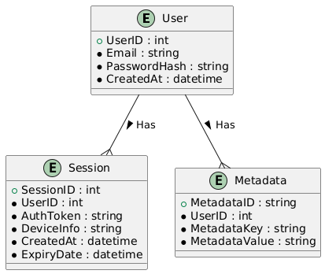

# 1. Компоненты системы

## 1. Клиент (Client)

Описание: CLI-приложение, с которым взаимодействует пользователь. 
Функции: 
- Регистрация и аутентификация пользователя.
- Отправка запросов на сервер для хранения, получения и синхронизации данных.
- Работа с пользовательскими данными через TUI.
- Получение и отображение данных о версии и дате сборки клиента.

## 2. Сервер (Server)

Описание: Центральный компонент системы, отвечающий за обработку запросов от клиентов, управление данными и взаимодействие с базами данных. 
Функции: 
- Обработка запросов на регистрацию, аутентификацию и авторизацию пользователей.
- Генерация и отправка OTP на email пользователя для подтверждения регистрации.
- Хранение данных пользователей в MinIO и метаинформации в MongoDB.
- Синхронизация данных между различными клиентами одного пользователя.
- Передача данных клиенту по запросу через gRPC.

## 3. База данных для авторизации (PostgreSQL)

Описание: База данных, хранящая информацию о пользователях и их учетных данных. 
Функции: 
- Хранение информации о пользователях (логины, хешированные пароли, email, OTP).
- Управление сессиями и токенами доступа.
- Логирование событий безопасности (например, неудачные попытки входа).

## 4. Хранилище данных (MinIO)

Описание: Объектное хранилище, используемое для хранения приватных данных пользователей. 
Функции: 
- Хранение файлов и бинарных данных пользователей.
- Обеспечение доступа к данным через gRPC.

## 5. База данных для метаинформации (MongoDB)

Описание: NoSQL база данных, используемая для хранения метаинформации о документах, хранящихся в MinIO. 
Функции: 
- Хранение метаинформации о документах (например, название, теги, дата создания, связанный веб-сайт).
- Обеспечение быстрого доступа к метаданным для поиска и фильтрации.

# 3. ER Диаграмма

# 4. Диаграмма компонентов общая 

## 4.1 Диаграмма взаимодействия компонентов

## 4.2 Диаграмма компонентов подробная

# 5. Безопасность и шифрование
Шифрование данных: Все данные, хранящиеся в MinIO, зашифрованы. 
Безопасная передача: Взаимодействие между клиентом и сервером должно происходить по защищенному каналу (TLS). 
OTP: Использование одноразовых паролей для регистрации пользователей, чтобы предотвратить несанкционированный доступ. 